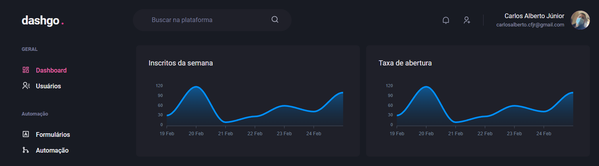
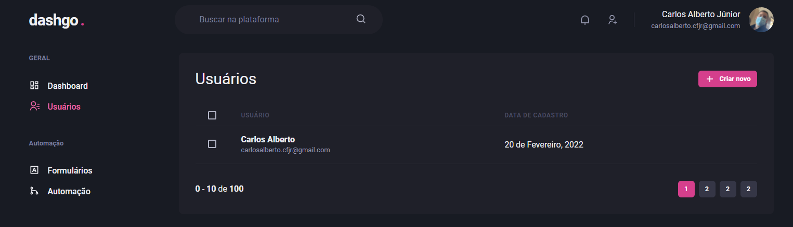
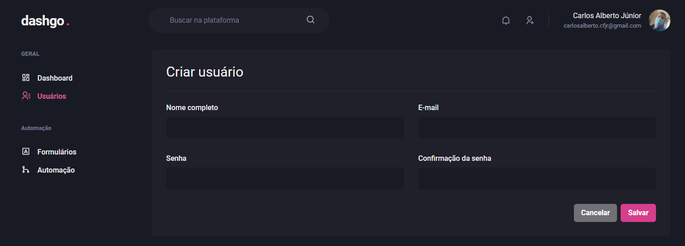
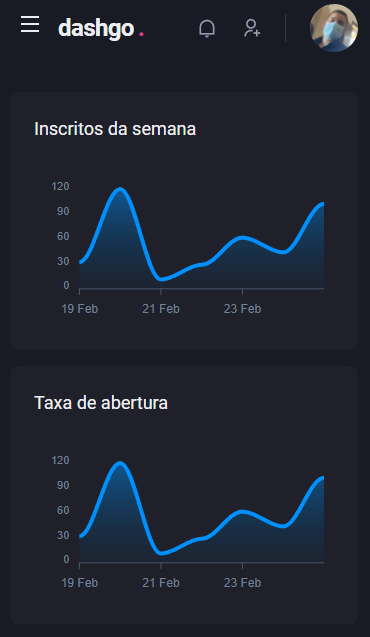
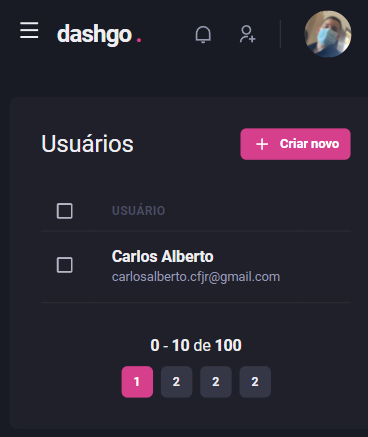
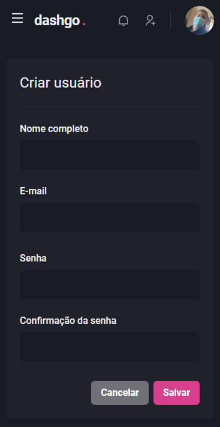

  

  <a href="https://github.com/mateusdeitos">
    
  <a>

## Description
- Dashboard application created in Ignite Bootcamp IV

## Features 🚀
 - Typescript
 - React + Next.js
 - React hook form
 - Styling using Chakra-ui
 - React context api

## Screens 💻

<h4>Dashboard</h4>
  
<h4>Users table</h4>
  
<h4>Create new User form</h4>
  

## Responsive 📱

<h4>Dashboard</h4>
  
<h4>Users table</h4>
  
<h4>Create new User form</h4>
  

## Contact ✉
  - <a target="_blank" href="https://www.linkedin.com/in/cfjr/">LinkedIn</a>
  - <a target="_blank" href="mailto:carlosalberto.cfjr@gmail.com">E-mail</a>
